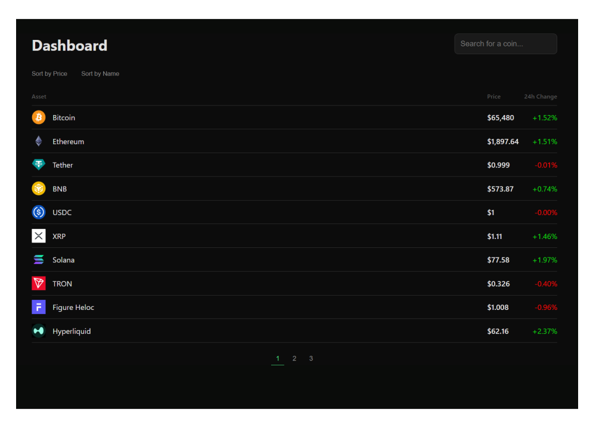

<em>— Інтерфейс дашборду з пошуком, сортуванням та актуальними даними криптовалют.</em>

## Концепція проєкту
**CoinVault** — це швидкий та зручний вебдодаток для відстеження курсів криптовалют у реальному часі. Головна мета — надати користувачу чистий, адаптивний інструмент із миттєвим пошуком, актуальною статистикою та плавною роботою без жодних затримок.

## Що зроблено та особливості
*   **Живі дані з ринку:** Інтеграція із зовнішнім криптовалютним API із захистом від перевантажень, завдяки чому додаток працює стабільно.
*   **Миттєвий пошук і фільтри:** Зручне сортування монет за назвою, ціною чи добовими змінами в один клік.
*   **Детальна інформація:** Окремі сторінки для кожної криптомонети з повною аналітикою та історією.
*   **Сучасний дизайн:** Витриманий темний інтерфейс у стилі фінансових платформ із підсвічуванням зростання чи падіння цін.

## Технології
*   **Фронтенд:** React 19, Vite
*   **Навігація:** React Router DOM
*   **Стилізація:** Кастомний темний дизайн (CSS3)
*   **Дані:** Зовнішнє API ринку криптовалют